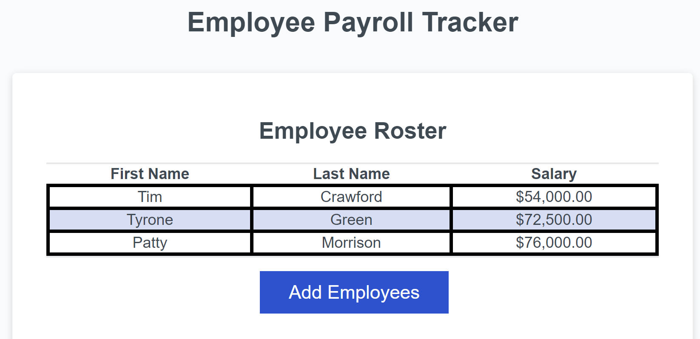
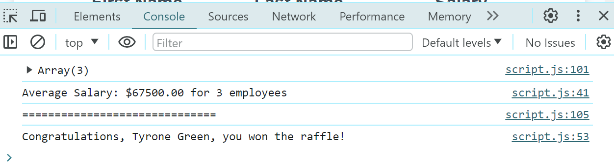

# Employee-Payroll-Tracker-Refactor

Implimented JavaScript to an employee payroll tracking website in order to make it functional.

## Description

This website is an Employee Payroll Tracker, where users are able to add employees' first name, last name, and salary. This website will then calculate the average salary as well as pull a random raffle winner from the employees that were added. Both are viewable in the console.

## Features

The following features are now functional:

- Clicking "Add Employee" will trigger a series of prompts for the user to input employee information to be viewed in the table.
- After adding initial employees, licking "Add Employee" once more grants the user the ability to add more employees to the table.
- The table will display the list of employees with their first names, last names, and salaries, and order them alphabetically by    last name.
- The average salary is viewable in the console.
- The raffle winner is determined randomly and can be revealed in the console.

## Bug Fixes

- Employees now display on the page as intended and are ordered alphabetically.
    

- Average salary and raffle winner now display in the console as intended.
    
